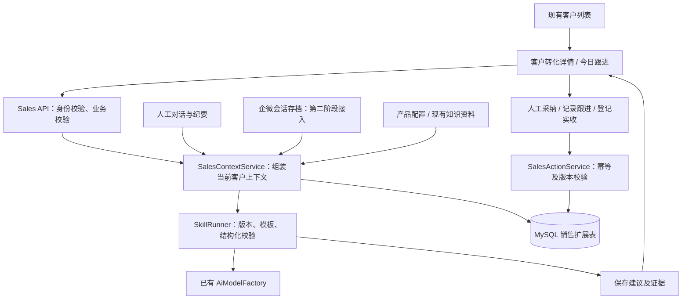

# 集智 AI 获客后转化助手二次开发方案

日期：2026-10-05。状态：**设计基线；核心销售闭环已实现，部署和外部服务验收单独记录**。

实施进度见 [README](../README.md)。下文保留设计时的评估语境；当前实现已包含单聊会话同步、持久化游标及结构化校验，实际路径以源码和部署说明为准。

检查基线：本地 `Iyque-SCRM` 的 `master` 分支，HEAD `288ef70`，包含现有未提交的品牌、前端及客服代码改动。方案编写时尚未修改业务代码；后续开发基于此设计继续实施。

## 1. 要交付的最小产品

**在源雀现有客户管理上，增加一个“获客后转化助手”：整理客户需求、给出有依据的回复、安排下一次跟进、记录实际成交。**

假设第一批客户已添加企业微信，由你或一名运营人员负责沟通。小红书、抖音继续承担获客，首版只记录来源，不接入它们的内容发布或站内私信。实际消息渠道、会话存档权限尚待确认，因此首版支持手工粘贴对话，即使没有会话存档也能使用。

最小使用流程：

1. 同步已有企微客户，在客户列表点击“转化跟进”，创建或打开销售档案。
2. 粘贴最近对话，或录入一条沟通纪要，并明确客户/销售的发言角色。
3. 点击“分析客户”，查看需求、顾虑、意向产品，以及每条判断对应的对话依据。
4. 点击“建议回复”，得到可编辑的回复和可用资料；人工复制到实际聊天窗口发送。
5. 确认下一次跟进任务，在“今日跟进”页执行；复制文案不会自动标记已发送。
6. 成交后人工登记实收金额和日期，更新成交状态，结束该客户未完成的转化跟进任务。

范围：一个企业、一个内部管理工作台、一个管理员使用。首版不包含多租户售卖、多销售权限体系、收银系统或自动发送客户消息。以后增加这些能力时再补对应的产品与权限设计。

## 2. 本地代码已经有什么，缺什么

| 能力 | 已检查到的实现 | 本轮处理 |
|---|---|---|
| 客户管理 | `IYQueCustomerInfo`、`IYqueCustomerInfoController`；客户同步、查询、标签 | 复用；增加销售档案入口和明确的 ID 映射 |
| 添加客户回调 | `IYqueCustomerInfoServiceImpl.addCustomerCallBackAction` | 客户入库目前依赖可识别的渠道 `state`；补上普通添加客户的基础入库路径 |
| 会话存档 | `IYqueMsgAuditServiceImpl`；有单聊、群聊文字处理分支 | 自动接入前修正分页、游标与异步落库问题；首版手工输入可先交付 |
| 微信客服 | `IYqueKfServiceImpl.handleKfMsg` | 可供后续独立接入；分页处理存在缺口，不能直接当作完整客户对话源 |
| AI 调用 | `AiModelFactory`、`IYqueAiServiceImpl` | 复用模型接入；新增销售专用输入组装和输出校验 |
| 提示词 | `AiPromptManager` 当前加载 `recommend-reply` 配置 | 尚不是 Skill 执行框架，需要补版本、输入输出约束、运行记录与采纳动作 |
| 知识资料 | 已有知识库、资料相关模块及 Milvus 接入 | 先复用已可用的资料能力；产品、价格、资料链接需有可核验的固定来源 |
| 销售闭环 | 未发现完整的销售阶段、跟进任务、实收登记模块 | 新增，是此次二开的核心 |

这里以当前源码为准。历史能力分析文档中的“会话存档不支持群聊”与当前分支不一致：代码已有群聊文字分支；本方案的客户分析仍只使用明确归属于该客户的单聊或人工纪要。

### 必须保留的现有字段语义

- 客户 `eId` 是 `externalUserid + "&" + userId`，代表“外部联系人—跟进员工”的关系。
- `state` 是添加渠道标识，不能改成销售阶段。
- `status` 表示正常、客户流失、员工删除客户，不能改成成交状态。
- 前端客户接口存在 `customerId` 命名，而实体使用 `eId`。新功能使用明确的 DTO 映射及独立 `leadId`，不要直接依赖现有命名猜测客户身份。
- 当前配置服务读取首个企业配置，首版延续单企业部署；这不等于已经具备 SaaS 多租户能力。

## 3. 需要开发的六块功能

| 模块 | 最小交付 | 可见结果 |
|---|---|---|
| 客户销售档案 | 来源、负责人、需求、产品、顾虑、销售阶段、停止跟进标记、人工修正 | 打开客户就能知道谈到哪一步 |
| 客户上下文 | 手工对话/纪要；后续接入该客户双向聊天 | AI 不会混入其他客户的信息 |
| 三个销售 Skill | 客户分析、建议回复、跟进计划 | 建议带依据，字段可采纳，文案可编辑 |
| 跟进任务 | 到期、完成、延期、取消；今日及逾期列表 | 明确今天该跟进谁、做什么 |
| 成交登记 | 手工记录实际收款、作废纠错、操作人和时间 | 成交有记录，收入有来源 |
| 简单统计 | 新增档案、待办/逾期、已成交、有效实收 | 判断工具是否帮助完成转化 |

前端只新增两个主要页面：

- **客户转化详情**：档案、对话/纪要、AI 建议、跟进、成交记录集中展示。AI 推测与人工确认信息分开展示。
- **今日跟进**：到期和逾期任务、客户摘要、建议动作、完成/延期按钮，以及少量统计卡片。

现有客户列表增加“转化跟进”按钮。第一版不另做大型驾驶舱；主要使用者在 PC 工作台操作，原有移动端暂不扩展。

## 4. 技术架构

沿用 Java 17、Spring Boot 2.7、MySQL、Vue 3、Element Plus，以及现有模型工厂。新增销售业务包，不拆微服务，不新增独立智能体平台。



消息读取、业务判断、写入记录分开实现：Skill 输出建议；后端服务决定允许修改哪些字段；用户采纳后才写入正式业务状态。模型没有任意 SQL、Shell 或对外发送权限。

### Skill 的具体实现

这里的 Skill 是本项目需要实现的“销售能力包”，**不是把 `SKILL.md` 放进目录就会自动生效**。开发工具里的 Skill 与线上 Java 应用执行的能力包也是两件事。

建议目录如下；包格式是本项目约定，不宣称与其他 Agent 产品直接兼容：

```text
src/main/resources/sales-skills/
  analyze-lead/
    SKILL.md
    manifest.yml
    input.schema.json
    output.schema.json
  suggest-reply/...
  plan-followup/...
src/main/resources/sales-catalog/
  products.yml
src/main/java/cn/iyque/sales/
  controller/
  domain/
  dto/
  repository/
  service/
  skill/
```

`manifest.yml` 至少包含 ID、版本、提示词文件、输入/输出 Schema、允许读取的数据类型。服务端显式注册三个 Skill，不执行包内任意脚本。

| Skill | 输入 | 输出 | 必须校验 |
|---|---|---|---|
| `analyze-lead` | 客户档案、带角色与时间的对话、现有产品 | 需求、顾虑、意向产品、缺失信息、阶段建议、证据 ID | 无依据的事实保持未知；阶段建议不能直接产生“已成交” |
| `suggest-reply` | 档案、最近问题、可用产品/资料 | 回复草稿、资料 ID、引用依据、需要人工确认的问题 | 价格、产品名、链接必须来自有效配置；无资料时明确待确认 |
| `plan-followup` | 档案、最近沟通、未完成任务 | 下一步动作、建议时间、原因、停止条件 | 禁止重复任务；停止联系、已成交或不再推进的客户不生成转化跟进 |

运行时补齐：

1. 服务端按 `leadId` 组装上下文，不接受浏览器提供的任意客户范围。
2. 保存 Skill 版本、模型标识、输入引用、上下文版本及运行状态。
3. 复用模型工厂调用，解析为 DTO，并做 JSON Schema、枚举、长度、时间及产品引用校验。
4. 校验失败或模型超时只记录失败，不能修改客户档案或创建任务。
5. 用户采纳时再次检查客户与上下文版本；新消息或人工修改已改变上下文，则提示重新分析。
6. 价格和金额由产品配置及人工实收记录决定，不能从模型自由生成的文本直接写入账目。

首版可采用一次有超时上限的同步模型请求，不必建设通用任务队列。运行记录先入库，模型调用放在数据库事务外；设置并发上限。重复请求依靠幂等键返回原运行状态，异常中断的运行记录通过超时清理标记失败，避免永久显示“生成中”。

产品配置初期使用版本化 YAML/JSON：产品 ID、名称、适用条件、有效价格/报价规则、可发送资料 ID。产品目录较小时无需再做后台管理页面。知识库只补充解释依据，不能覆盖已经确认的价格规则。未检查其他本地知识系统的 API，因此本期不依赖额外系统集成。

## 5. 数据模型：新增五张业务表

采用扩展表，避免同步客户信息时覆盖销售数据。以下是逻辑字段，实际迁移需要结合现有数据库版本和命名方式生成。

| 表 | 关键字段与规则 |
|---|---|
| `iyque_sales_lead` | `id`、服务端企业标识、`customer_e_id`、`external_user_id`、`owner_user_id`、来源、产品、需求、顾虑、销售阶段、停止跟进标记、档案版本、上下文版本；企业+`customer_e_id` 唯一 |
| `iyque_sales_activity` | `id`、`lead_id`、类型、发言角色、发生时间、内容/源消息引用、操作者；记录手工对话、跟进结果、阶段变更，形成时间线 |
| `iyque_sales_followup_task` | `id`、`lead_id`、到期时间、动作、原因、建议来源、状态、完成时间、幂等键、版本；状态为待办/完成/取消，延期更新到期时间并留活动记录 |
| `iyque_sales_skill_run` | `id`、`lead_id`、Skill ID/版本、模型标识、上下文版本、输入引用、校验后输出、运行状态、采纳记录、耗时、错误码、请求幂等键 |
| `iyque_sales_receipt` | `id`、`lead_id`、产品、币种、实收金额、收款时间、有效/作废状态、外部凭证号（可选）、操作者、请求幂等键；金额使用 DECIMAL |

身份规则：

- 首版一条销售档案对应一个现有客户—员工关系。相同客户跟随不同员工时，不按昵称自动合并。
- 统计销售档案数量时使用 `leadId`；如展示“去重客户人数”，按企业和外部联系人 ID 单独计算并标明口径。
- 微信客服身份另有来源标识，后续接入需核实映射关系，不与员工客户关系默认合并。

建议销售阶段：新线索 → 沟通中 → 已明确需求 → 已报价 → 已成交；另有“不再推进”。允许人工回退非成交阶段并留痕。“已成交”由有效实收登记产生，不因“客户说想买”或 AI 意向判断而产生。作废最后一笔有效实收时，重新确认销售阶段，不自动恢复旧跟进任务。

首版登记的是手工确认的实收台账，不连接支付网关，也不代替财务系统。错误登记可以作废并保留记录；真实退款流程另行设计，不能与录入纠错混为一谈。

第二阶段接入消息后，再增加持久化同步游标及失败重试记录，不借用“最后一条已落库业务消息”充当完整处理进度。

## 6. 接口与页面改动位置

接口前缀建议为 `/sales`，仍经过现有登录校验。错误响应复用现有应用风格，但需区分版本冲突、无权访问、模型失败和字段校验失败。

| 接口组 | 建议接口 | 作用 |
|---|---|---|
| 档案 | `POST /sales/leads`、`GET /sales/leads`、`GET/PATCH /sales/leads/{id}` | 从现有客户关系幂等建立档案、查询、人工更新；更新携带预期版本 |
| 时间线 | `GET/POST /sales/leads/{id}/activities` | 查看历史、粘贴对话、登记沟通结果 |
| AI | `POST /sales/leads/{id}/skill-runs`、`GET /sales/skill-runs/{id}` | 指定 Skill 和请求幂等键；上下文由服务端组装 |
| 采纳 | `POST /sales/skill-runs/{id}/apply` | 提交允许采纳的字段/任务以及预期版本，事务内执行一次 |
| 跟进 | `GET/POST /sales/followups`、`POST /sales/followups/{id}/complete`、`/postpone`、`/cancel` | 查询和执行任务；完成需要实际跟进结果 |
| 实收 | `POST /sales/leads/{id}/receipts`、`POST /sales/receipts/{id}/void` | 幂等登记实收及作废纠错；同步维护成交状态和未完成转化任务 |
| 统计 | `GET /sales/metrics` | 按明确时间范围与口径返回统计卡片 |

前端改动：

- `frontEnd/pc/src/views/customer/index.vue`：增加销售档案入口，不覆盖原有标签、同步功能。
- `frontEnd/pc/src/views/customer/api.ts`：校正新增功能使用的客户 ID 映射。
- `frontEnd/pc/src/router/routes.js`：增加销售详情、今日跟进路由。
- 新增 `frontEnd/pc/src/views/sales/LeadDetail.vue`、`FollowupList.vue`、`api.ts`，及必要的档案、AI 建议、成交登记组件。

后端改动：

- 新增销售控制器、DTO、五张表对应实体/仓储、`SalesContextService`、`SalesActionService`、`SkillRegistry`、`SkillRunner`。
- `IYqueCustomerInfoServiceImpl.addCustomerCallBackAction`：客户基础入库与渠道欢迎语等动作解耦；保存失败可重试，营销动作失败不能阻断客户保存。
- `AiModelFactory`：优先直接复用，模型接入不重写；现有通用字符串 JSON 返回不能代替销售 Skill 的结构化校验。
- SQL 使用明确的版本化迁移脚本；当前配置为 `ddl-auto: none`，不得依赖实体启动自动建表。首版无需为了五张表强行改造全项目迁移框架。

## 7. 自动对话接入要先解决的问题

以下问题来自静态源码检查，表示存在数据完整性风险，尚未通过线上日志验证发生频率。

| 位置 | 当前行为 | 接入前修正 |
|---|---|---|
| `IYqueMsgAuditServiceImpl.synchMsg` | 单次拉取最多 1000 条，以上次已存消息最大 seq 为起点；后续异步逐条保存 | 分页拉取；以完整处理页推进持久化游标；对回调重入加并发控制 |
| 同上 | 解密或处理异常仅记录日志；不同消息异步完成顺序不保证 | 失败有持久化重试依据；不能被后续成功消息的最大 seq 跳过 |
| `IYqueMsgAuditServiceImpl.findCustomerMsgData` | 原有分析按日期取消息并依赖 ID 前缀/分组逻辑 | 新建严格的客户双向上下文查询，不直接复用原分析结果 |
| `IYqueKfServiceImpl.handleKfMsg` | 先保存 nextCursor；只有 `hasMore == 0` 分支处理消息 | 逐页处理并可靠保存后推进游标，继续读取后续页 |
| 客户回调 | 普通无渠道 state 添加可能不进入当前保存分支 | 无论来源，先保存基础关系；渠道动作单独处理 |

单客户文字上下文应明确匹配：`acceptType = 1` 且“发送者是客户、接收者是当前员工”，或二者反向；按消息时间及稳定 ID 排序，再做长度裁剪。群聊不混入一对一上下文。没有拉到的数据展示为未知，不能提示“客户没有回复”。

消息 `msgId` 已是存档实体主键，可继续用于幂等。非文字消息必须有明确的忽略/待处理记录与游标处理规则；联系人暂时无法解析时保留消息身份引用，不因名称查询失败丢弃正文。回调先持久化接收工作，再按实际平台协议回应；实施时核验平台当前 ACK、权限和调用要求。

优先顺序：**首版人工输入 → 企微员工单聊存档接入 → 确有需求再接微信客服**。聊天数据可读取，不代表对应渠道一定可以自动发送；以后如增加自动发送，应单独核实该消息渠道可用接口与权限。

## 8. 统计、可靠性与权限

统计口径：

- 新增档案数：按档案创建时间计数。
- 到期/逾期任务：待办且到期时间满足查询条件；已取消不进入待办。
- 已成交档案：至少有一笔有效实收，按档案去重。
- 实收金额：按收款时间统计有效记录之和；作废记录不计入。
- 转化率：若首版展示，采用同一批次新增档案的后续成交数/该批次档案数，并显示观察截止日；不能拿“本月所有成交”除以“本月新增客户”。样本少时直接展示数量即可。

可靠性要求：

- 以一个管理员、百至千级档案作为首版设计假设，不宣称已完成容量测试。
- 对客户档案更新使用乐观版本；任务、采纳、实收登记有数据库唯一约束与幂等键。
- 模型服务故障时，客户档案、手工记录和跟进功能仍可使用；失败反馈清晰，避免自动无限重试。
- 日志只记录运行 ID、耗时、状态与脱敏错误，不输出模型密钥或完整客户对话；输入证据按访问权限展示。
- 上下文与产品说明作为数据传入，客户消息不能改变 Skill 的工具权限或业务写入规则。
- 首版销售接口仅允许配置的内部管理员访问。当前 JWT 校验不等于按负责人隔离；若开放给多个销售人员，必须先补服务端负责人访问范围、分配和转交规则。
- 数据库备份验证后执行增量建表；通过功能开关关闭新增销售入口可回退功能，已经产生的销售数据保留，不用删表回退。

## 9. 开发顺序与估时

以下为一名熟悉 Java/Vue 的开发者，在项目可以本地运行、测试数据和模型配置可用时的粗估。人日是开发投入，不包含平台权限申请、等待资料或现有环境故障处理。

| 阶段 | 交付 | 估计投入 |
|---|---|---|
| M0：基线 | 验证现有启动/构建、记录已有问题、准备匿名测试客户与迁移方式 | 1 人日 |
| M1：销售骨架 | 五张表及基础接口、客户入口、详情和今日跟进页面骨架、普通客户添加入库修正 | 2–3 人日 |
| M2：AI 建议 | 产品配置、三个 Skill、结构化校验、依据展示、采纳与版本检查 | 2–3 人日 |
| M3：转化闭环 | 跟进执行、实收与作废、停止条件、基础统计 | 2–3 人日 |
| M4：验收 | 场景测试、重复/并发/故障验证、试用问题修正 | 1–2 人日 |
| P1：自动会话 | 在存档条件具备时，修正存档同步、双向上下文、增量接入与回放验证 | 另估 3–5 人日 |

**首版约 8–12 人日**，先形成手工输入也能工作的闭环。自动会话接入另算；微信客服接入、多员工权限、移动端和 SaaS 化不包含在该估时内。

开发先建立手动可验证的路径，再接真实平台数据。这样每阶段都能用同一批客户场景验收，不需要等待所有外部权限齐备才开始试用。

## 10. 验收用例

优先验证业务结果和数据边界，避免只测试提示词是否包含某句话。

1. 同一客户重复点击创建档案，只产生一份对应客户—员工关系的档案。
2. 粘贴完整双向对话后，分析能区分客户诉求和销售承诺；没有提到的预算保持未知。
3. 两个客户讨论相似产品时，建议引用只来自当前客户与公共产品资料。
4. 不存在的资料链接、无效产品 ID、模型输出格式错误被拒绝；不创建错误任务或客户字段。
5. 生成建议后人工修改档案或新增对话，旧建议不能无提示覆盖新信息。
6. 连续点击采纳/创建跟进只产生一项预期动作；复制草稿不等于发送或完成任务。
7. 完成、延期、取消后的今日列表正确；停止跟进或有效成交时，旧转化任务停止。
8. “我想买”只影响意向判断；只有实际登记有效实收才形成成交和收入，重复登记不会重复计入。
9. 作废最后一笔实收后，金额、成交状态及审计记录一致；旧任务不会意外恢复。
10. 模型超时、服务重启或网络断开后，档案和人工跟进可用，运行状态可恢复为明确结果。
11. 普通无渠道 state 添加客户也可入库；欢迎语失败不导致客户记录缺失。
12. P1 中回放超过一页消息、重复回调、中间解密失败及落库失败，确认没有静默跳过消息，游标不会超前于可靠处理进度。

实施时运行对应后端测试、前端类型检查与构建，使用隔离测试数据，不连接生产数据执行写入测试。当前前端 `test` 脚本启动 Vite 测试模式，不是自动化测试；`build-check` 引用了未定义的 `build-only`，应先记录或修正脚本，再使用明确的 `type-check` 和 `build` 检查。

本次为源码审查与方案编写，未执行上述验收或应用构建，不把计划中的能力描述为已上线。

## 11. 关键架构决策（Proposed）

### ADR-001：在现有单体内扩展

- 背景：现有 Java/Vue 已覆盖客户、模型和基本资料，当前只有一个内部使用场景。
- 决策：新增销售业务模块和扩展表，复用登录、客户和模型工厂。
- 备选：独立 AI 服务、通用工作流平台、多服务架构。
- 取舍：部署成本较低，改动集中；需要保持销售模块接口边界，后续才有条件单独拆出。

### ADR-002：Skill 输出经过业务校验再采纳

- 背景：现有提示词管理和通用 JSON 字符串不能确保输出满足销售业务约束。
- 决策：明确三个能力包、版本、Schema 和证据引用；写操作走受约束的业务服务。
- 备选：只增加几段提示词，或引入可任意调用工具的通用 Agent。
- 取舍：增加少量执行与校验代码，换取可追踪的建议、可控的写入和可重复验收。

### ADR-003：先人工输入及发送，再自动同步

- 背景：真实承接渠道与会话存档条件未确认；当前同步实现需要补可靠性。
- 决策：首版人工录入对话和执行发送；存档作为后续上下文来源。
- 备选：首版强依赖全自动读写平台消息。
- 取舍：用户仍需粘贴和复制，但最小闭环可以独立交付；自动化收益后续通过接入增量获得。

### ADR-004：业务状态独立于企微关系状态

- 背景：原客户表已有明确的身份、渠道、好友关系字段，且受同步更新影响。
- 决策：新增销售档案，以客户关系为关联；独立销售阶段和实收台账。
- 备选：复用 `state/status` 或把 AI 推断全部塞入客户标签。
- 取舍：多一层关联，避免字段语义冲突、同步覆盖和把意向误统计成成交。

## 12. 实施前需要补齐的业务资料

以下信息影响配置与第二阶段范围，不妨碍先按本方案开发首版骨架：

- 实际承接渠道：企微员工单聊、微信客服，或其他渠道；目前按企微客户+人工操作假设。
- 一个先试用的业务：产品名称、有效价格或报价规则、常见顾虑、可发资料，以及停止跟进条件。
- 一组去除个人信息的典型对话，覆盖咨询、犹豫、明确拒绝、成交，供 Skill 验收。
- 会话存档是否已开通、哪些员工可读取、是否有可用测试账号；这决定 P1 是否能立即开展。
- 实际操作人数；如果超过一个管理员，需要把账号与负责人权限列入首版必要范围并重新估时。

建议第一批只验证一个产品、一条转化流程。先确认“客户分析是否准确、跟进是否执行、实际成交是否有改善”，再增加其他数字员工职责。
